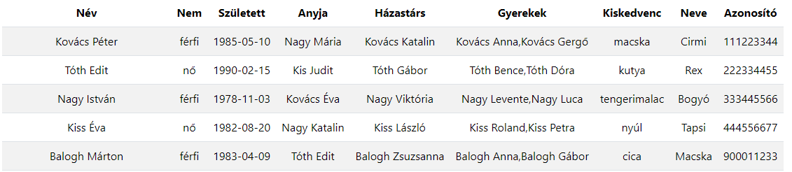

# RESTFull kezdemény JSON fájlból

## 1. lépés - JSON fájlból adatok megjelenítése

Axios használatával MVC modellben

1. DataService osztály a modellben
2. Controllerben példányosítjuk
3. Meghívjuk az Axios get metódusát, paraméterek: végpont, callback függvény
4. A callback függvényben példányosítjuk a View-t - TablaView
5. TableView példányosítja a sorokat - RowView

